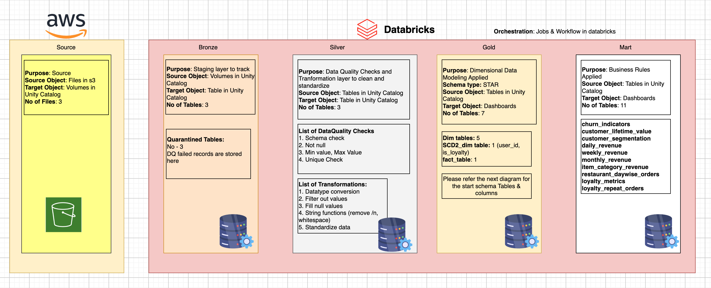

# 🚀 AWS Databricks Medallion Architecture Project

> **An end-to-end data engineering pipeline built on AWS and Databricks using the Medallion Architecture pattern: Bronze, Silver, Gold, and Business Mart layers.**

<p align="center">
  
</p>

---

## 📌 Project Overview

This project demonstrates an end-to-end **data engineering pipeline** built using **Amazon S3**, **Databricks**, **Delta Lake**, and **Unity Catalog**.

The pipeline ingests raw files from **Amazon S3**, applies data-quality validations and transformations, creates a dimensional **Star Schema**, maintains user history using **Slowly Changing Dimension Type 2 (SCD Type 2)**, and publishes business-ready **data marts** for analytics and dashboard reporting.

### 🎯 Project Objectives

- 📥 Ingest raw source files from **Amazon S3**
- 🥉 Build a **Bronze** staging and ingestion layer
- 🧹 Clean, validate, and standardize data in the **Silver** layer
- 🧪 Store failed records in **quarantine tables**
- 🥇 Build a dimensional **Star Schema** in the **Gold** layer
- 🕒 Implement **SCD Type 2** for `user_id` historical data
- 📊 Create analytics-ready **Business Mart** tables
- ⚙️ Orchestrate the complete workflow using **Databricks Jobs and Workflows**

---

## 🏗️ Architecture

```text
┌─────────────────────┐
│   ☁️ Amazon S3       │
│   Raw Source Files  │
└─────────┬───────────┘
          │
          ▼
┌─────────────────────┐
│ 🥉 Bronze Layer      │
│ Raw Ingestion       │
│ Staging Tables      │
│ Quarantine Tables   │
└─────────┬───────────┘
          │
          ▼
┌─────────────────────┐
│ 🥈 Silver Layer      │
│ Data Quality Checks │
│ Cleansing           │
│ Standardization     │
└─────────┬───────────┘
          │
          ▼
┌─────────────────────┐
│ 🥇 Gold Layer        │
│ Star Schema         │
│ Dimensions + Facts  │
│ SCD Type 2          │
└─────────┬───────────┘
          │
          ▼
┌─────────────────────┐
│ 📊 Business Marts    │
│ Business Rules      │
│ Reporting Tables    │
│ Dashboards          │
└─────────────────────┘
```

---

## 🛠️ Technology Stack

| Category | Technologies |
|:--|:--|
| ☁️ **Cloud Platform** | AWS |
| 🗂️ **Source Storage** | Amazon S3 |
| ⚡ **Data Processing** | Databricks |
| 🧱 **Storage Layer** | Delta Lake |
| 🔐 **Data Governance** | Unity Catalog |
| 🔄 **Orchestration** | Databricks Jobs and Workflows |
| 🧮 **Data Modeling** | Dimensional Modeling / Star Schema |
| 🕒 **Historical Tracking** | SCD Type 2 |
| 🧪 **Data Quality** | Schema, Null, Range, and Uniqueness Validation |
| 💻 **Programming** | PySpark, SQL |

---

## 📥 Source Layer

The source data is stored in **Amazon S3** and made available to Databricks through **Unity Catalog Volumes**.

### Source Details

| Property | Details |
|:--|:--|
| **Source System** | Amazon S3 |
| **Source Object** | Source files |
| **Target Location** | Unity Catalog Volumes |
| **Number of Source Files** | 3 |
| **Processing Platform** | Databricks |

```text
Amazon S3 Files
      ↓
Unity Catalog Volumes
      ↓
Bronze Delta Tables
```

---

## 🥉 Bronze Layer

The **Bronze layer** is the raw ingestion and staging layer of the pipeline.

Its purpose is to load source files from Unity Catalog Volumes into Delta tables while keeping transformations minimal. This layer provides traceability and preserves source-level data for audit and reprocessing purposes.

### Bronze Layer Responsibilities

- 📥 Ingest source files from Unity Catalog Volumes
- 🗃️ Store raw data as Delta tables
- 🔍 Preserve the original source structure
- 🧾 Capture ingestion metadata where needed
- 🔄 Provide a reliable input layer for Silver transformations
- 🚧 Route invalid records to quarantine tables

### Bronze Tables

```text
Number of Bronze Tables: 3
```

### Recommended Audit Columns

```text
source_file_name
ingestion_timestamp
batch_id
load_date
record_status
```

---

## 🚧 Quarantine Tables

The pipeline uses quarantine tables to store invalid records that fail data-quality validations.

Instead of dropping failed records, the pipeline preserves them for investigation, correction, and potential reprocessing.

### Quarantine Table Benefits

- ✅ Prevents silent data loss
- 🔎 Makes data issues visible
- 🧾 Supports auditability and traceability
- 🔁 Enables correction and reprocessing
- 📈 Helps improve upstream source-data quality

```text
Number of Quarantine Tables: 3
```

### Example Quarantine Table Columns

```text
source_table
failed_record
failed_rule
failure_reason
ingestion_timestamp
batch_id
```

---

## 🥈 Silver Layer

The **Silver layer** is the trusted and cleaned data layer.

This layer performs data-quality validation, cleansing, standardization, datatype conversion, and business-level transformations before data is used for dimensional modeling.

### Silver Layer Responsibilities

- 🧪 Run data-quality checks
- 🧹 Clean and standardize source data
- 🔤 Remove unnecessary whitespace and newline characters
- 🔁 Convert columns into correct data types
- 🚫 Filter invalid or unwanted records
- 🏷️ Create trusted detailed datasets for the Gold layer

```text
Number of Silver Tables: 3
```

---

## ✅ Data Quality Checks

The following data-quality checks are performed before data is promoted to the Silver layer:

| Check | Description |
|:--|:--|
| 🧩 **Schema Check** | Verifies that expected columns and compatible data types are present |
| 🚫 **Not Null Check** | Ensures mandatory columns do not contain null values |
| 📏 **Min Value Check** | Ensures numeric values do not fall below an acceptable threshold |
| 📐 **Max Value Check** | Ensures numeric values do not exceed an acceptable threshold |
| 🔑 **Unique Check** | Identifies duplicate business keys or duplicate records |

### Data Quality Flow

```text
Raw Bronze Data
      │
      ├── ✅ Valid Records ──> Silver Tables
      │
      └── ❌ Invalid Records ──> Quarantine Tables
```

---

## 🧹 Silver Layer Transformations

The following transformations are applied to prepare clean and reliable data:

1. 🔄 **Data type conversion**
2. 🚫 **Filtering invalid values**
3. 🧩 **Null-value handling**
4. ✂️ **Removing newline characters**
5. 🧼 **Removing extra whitespace**
6. 🔤 **Standardizing text values**
7. 📅 **Formatting date and timestamp columns**
8. 🔑 **Preparing data for dimension and fact tables**

### Example PySpark Transformation

```python
from pyspark.sql.functions import col, trim, regexp_replace

cleaned_df = (
    bronze_df
    .withColumn("customer_name", trim(col("customer_name")))
    .withColumn(
        "customer_name",
        regexp_replace(col("customer_name"), r"[\r\n]+", " ")
    )
    .filter(col("user_id").isNotNull())
)
```

---

## 🥇 Gold Layer

The **Gold layer** contains analytics-ready dimensional tables designed using a **Star Schema**.

This layer is optimized for reporting, dashboard development, and analytical queries.

### Gold Layer Components

| Table Type | Count | Description |
|:--|:--:|:--|
| 📚 Dimension Tables | 5 | Stores descriptive attributes used for filtering and grouping |
| 🕒 SCD Type 2 Dimension | 1 | Preserves historical changes in user information |
| 📈 Fact Tables | 1 | Stores measurable business events and metrics |
| ⭐ Schema Type | Star Schema | Supports efficient analytics and dashboard queries |

### Gold Layer Data Model

```text
                 ┌─────────────────┐
                 │   Dim User      │
                 │   SCD Type 2    │
                 └────────┬────────┘
                          │
┌───────────────┐         │         ┌───────────────┐
│ Dim Restaurant│─────────┼─────────│   Dim Item    │
└───────────────┘         │         └───────────────┘
                          │
                  ┌───────▼────────┐
                  │   Fact Orders  │
                  │ Revenue / Qty  │
                  └───────┬────────┘
                          │
          ┌───────────────┼────────────────┐
          │               │                │
          ▼               ▼                ▼
 ┌──────────────┐ ┌──────────────┐ ┌──────────────┐
 │ Dim Date     │ │ Dim Category │ │ Other Dims   │
 └──────────────┘ └──────────────┘ └──────────────┘
```

---

## 🕒 SCD Type 2 Implementation

A **Slowly Changing Dimension Type 2** process was implemented for the `user_id` table using historical source data.

The purpose of SCD Type 2 is to preserve historical versions of a user record when selected user attributes change over time.

Instead of overwriting an existing record, the pipeline closes the current version and inserts a new version.

### Business Key

```text
user_id
```

### Typical SCD Type 2 Columns

```text
user_sk
user_id
user_name
email
loyalty_status
effective_start_date
effective_end_date
is_current
record_hash
```

### SCD Type 2 Process

```text
New User Record
      │
      ▼
Insert New User Version
is_current = true
effective_end_date = null
```

```text
Existing User Attribute Changes
      │
      ▼
Expire Existing Version
is_current = false
effective_end_date = current_date
      │
      ▼
Insert New Current Version
is_current = true
effective_start_date = current_date
```

### Example SCD Type 2 History

| user_id | loyalty_status | effective_start_date | effective_end_date | is_current |
|:--:|:--|:--|:--|:--:|
| 101 | Standard | 2025-01-01 | 2025-06-14 | ❌ False |
| 101 | Gold | 2025-06-15 | `NULL` | ✅ True |

### Why SCD Type 2 Matters

SCD Type 2 makes historical reporting possible.

For example, it can answer questions such as:

- 📌 What was a user’s loyalty status when an order was placed?
- 📌 When did a customer move from **Standard** to **Gold** loyalty status?
- 📌 How many users changed loyalty tiers in a given month?
- 📌 Which customer attributes were active at a specific point in time?

---

## 📊 Business Mart Layer

The **Mart layer** contains business-rule-driven tables built from the Gold star schema.

These tables are designed for dashboards, reporting, self-service analytics, and business decision-making.

### Business Mart Tables

| # | Mart Table | Business Purpose |
|:--:|:--|:--|
| 1 | `churn_indicators` | Identifies users at risk of churn based on ordering activity and recency |
| 2 | `customer_lifetime_value` | Calculates total customer value based on historical revenue and orders |
| 3 | `customer_segmentation` | Groups customers based on spending, frequency, recency, and loyalty behavior |
| 4 | `daily_revenue` | Provides daily revenue trends and operational metrics |
| 5 | `weekly_revenue` | Aggregates revenue at the weekly level |
| 6 | `monthly_revenue` | Provides monthly revenue reporting and trend analysis |
| 7 | `item_category_revenue` | Analyzes revenue contribution by item category |
| 8 | `restaurant_daywise_orders` | Tracks daily order performance by restaurant |
| 9 | `loyalty_metrics` | Measures loyalty-program engagement and performance |
| 10 | `loyalty_repeat_orders` | Analyzes repeat-order behavior for loyalty users |

> 📝 **Note:** The architecture diagram indicates **11 mart tables**, while ten mart table names are currently listed. Add the remaining table name here if applicable.

---

## ⚙️ Orchestration

The pipeline is orchestrated using **Databricks Jobs and Workflows**.

Each processing layer runs in a controlled dependency sequence to ensure that downstream tables are built only after upstream datasets complete successfully.

### Workflow Execution Order

```text
1. 📥 Ingest source files from Amazon S3
2. 🥉 Load data into Bronze Delta tables
3. 🧪 Run data-quality validations
4. 🚧 Store failed records in quarantine tables
5. 🥈 Transform valid records into Silver tables
6. 🕒 Apply SCD Type 2 logic for user history
7. 🥇 Build Gold dimensions and fact tables
8. 📊 Create Business Mart tables
9. 📈 Refresh dashboard-ready datasets
```

---

## 📈 Business Value

This project creates a scalable and maintainable analytics platform by separating ingestion, transformation, dimensional modeling, historical tracking, and reporting layers.

### Key Benefits

- ✅ Provides reliable and trusted data for analytics
- ✅ Preserves user history through SCD Type 2
- ✅ Prevents silent data loss using quarantine tables
- ✅ Supports customer, loyalty, restaurant, and revenue analytics
- ✅ Improves dashboard performance using dimensional models and marts
- ✅ Enables governed access through Unity Catalog
- ✅ Supports reusable and scalable Databricks workflows
- ✅ Creates a strong foundation for future real-time and CDC-based pipelines

---

## 🔮 Future Enhancements

- [ ] Add automated alerting for data-quality failures
- [ ] Add data-quality scorecards and monitoring dashboards
- [ ] Implement incremental loading using Delta Lake `MERGE`
- [ ] Add Change Data Capture (CDC) ingestion
- [ ] Add audit fields such as `created_at`, `updated_at`, and `batch_id`
- [ ] Add unit and integration tests for pipeline transformations
- [ ] Implement CI/CD using GitHub Actions and Databricks Asset Bundles
- [ ] Provision infrastructure using Terraform
- [ ] Add dbt for testing, lineage, and transformation documentation
- [ ] Add pipeline SLA monitoring and failure notifications

---

## 👤 Author

**Robinson Tamilselvan**

- 💼 Data Engineer
- ⚡ Databricks | PySpark | SQL | AWS | Delta Lake
- 🧱 Data Engineering | ETL/ELT | Data Warehousing | Dimensional Modeling

---

<p align="center">
  Built with ☁️ AWS, ⚡ Databricks, 🧱 Delta Lake, and 🐍 PySpark
</p>
